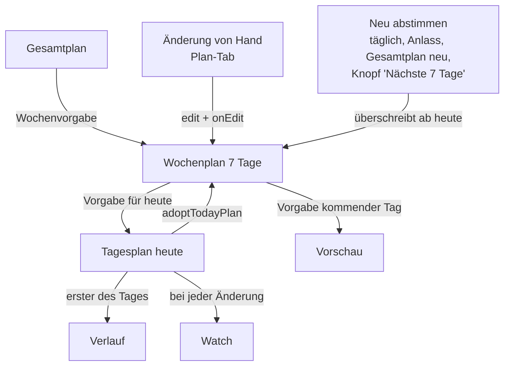
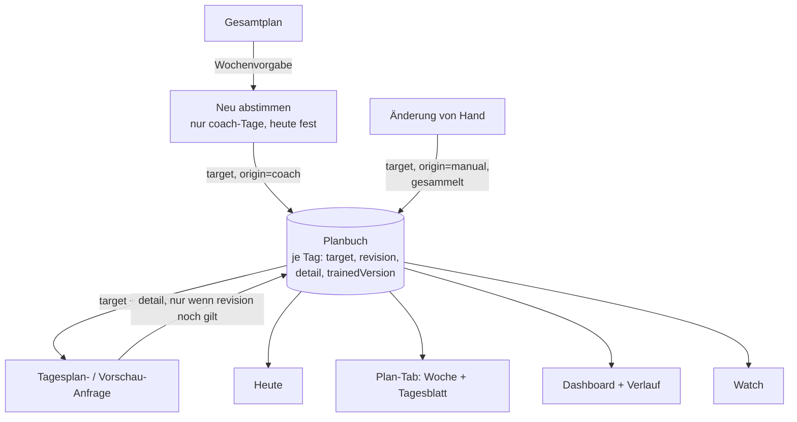

# Plan-Synchronisierung: Ist-Zustand und Vorschlag

Stand 07.10.2026. Welche Pläne es gibt, wo sie liegen, wer sie ändert, welche Ansicht was zeigt, wo es brach und wie
es jetzt geregelt ist.

## Entschieden und umgesetzt (07.10.2026)

| Entscheidung | Umsetzung |
|---|---|
| Änderungen von Hand bleiben dauerhaft | Von Hand geänderte Tage (`isEdited`) bleiben beim Neu-Abstimmen und gehen als `fixed_days` an den Server; der plant die anderen Tage darum herum (ihr Umfang zählt in die Wochengrenzen, feste harte Tage bei "nie zwei harte Tage hintereinander"). Im Tagesblatt: "Wieder deinem Coach überlassen". "Doch wieder Zeit" gibt den Tag dem Coach zurück. |
| Heute bleibt stabil, nur auf deinen Wunsch geändert | Heute steht fest, sobald es einen Tagesplan oder eine Vorschau gibt oder schon trainiert wurde (`isTodayLocked`). Das Neu-Abstimmen (täglich, Beschwerden, Gesamtplan) ändert heute dann nicht mehr. Ändern: Plan-Tab, Wunsch oder Knopf „Plan neu erstellen“ auf Heute. |
| Vorschau am Tag selbst übernehmen | Gibt es für heute eine Vorschau mit gleicher Vorgabe, wird sie beim ersten Öffnen der Tagesplan, ohne Claude-Aufruf. |
| Verlauf: letzter Stand des Tages | Der Verlauf hält je Tag den letzten Tagesplan; "Plan gegen Ist" vergleicht damit. |
| Sofort-Fixes F1, F2, F4 | Eine Antwort, deren Vorgabe sich unterwegs geändert hat, wird verworfen und neu gefragt. Mehrere Tipps hintereinander ergeben eine Anfrage (1,5 s Pause). Ein Ersatzplan gilt nicht als passend und zeigt einen Hinweis. |

Das Planbuch aus Abschnitt 6 (eine Datei für alles) ist damit nicht mehr nötig, um die Ansichten gleich zu halten:
Die Regeln gelten auf den bestehenden Speichern. Es bleibt eine Option für später. Offen ist noch R9 (Watch zeigt
"wird angepasst").

## 1. Welche Pläne es gibt

Es gibt vier Ebenen. Jede höhere gibt der darunter vor, *was* passieren soll; die unterste sagt, *wie* (Schritte).

| Ebene | Inhalt | Datei auf dem iPhone | Besitzer im Code | Entsteht durch |
|---|---|---|---|---|
| **Gesamtplan** | Wochen bis zum Ziel: Phase, Umfang je Sportart, Tests | `macro-plan-v2.json` | `MultiSportMacroLoader` | Claude (`/plan/macro`), Feedback, Fortschreibung alle 2 Wochen |
| **Wochenplan (7 Tage)** | je Tag 0–2 Einheiten: Sportart, Art, Intensität, Umfang, Koppel/drinnen/Freiwasser, Kraft/Mobilität | `week-plans-v2.json` | `MultiSportWeekLoader.weeks` | Claude (`/plan/week`), Änderungen von Hand im Plan-Tab, Übernahme aus dem Tagesplan |
| **Tagesplan (heute)** | Einheiten mit Schritten, Zielen, Pausen, Equipment | `last-plan-v2.json` | `MultiSportTodayLoader.response` | Claude (`/plan/today`) mit der Vorgabe des Wochenplans für heute |
| **Vorschau (kommende Tage)** | wie Tagesplan, für einen späteren Tag | `day-previews-v2.json` | `MultiSportTodayLoader.previews` | Claude (`/plan/today` mit `date`), auf Knopfdruck |

Dazu kommen **Kopien**, die nachgezogen werden müssen:

| Kopie | Datei | Was drin ist | Wer schreibt |
|---|---|---|---|
| Verlauf | `plan-history-v2.json` | der **erste** Tagesplan jedes Tages | `MultiSportTodayLoader` nach jedem Abruf (`FileDayPlanV2History.record`) |
| Watch | Application Context + Datei auf der Uhr | der aktuelle Tagesplan | `PhonePlanSync`, sobald sich `response` ändert |
| Server-Cache | `/data/…/latest-plan-v2.json` | letzter Tagesplan je Nutzer, mit Fingerabdruck der Anfrage | Server; liefert ihn bei gleicher Anfrage wieder oder als Ersatzplan bei Ausfall |

## 2. Wie die Pläne zusammenhängen (Ist)

**Fingerabdruck:** Ein Tagesplan merkt sich die Vorgabe, mit der er geholt wurde (`requestedTarget`). Passt sie nicht
mehr zur Vorgabe im Wochenplan (`matchesTodayTarget`), gilt er als veraltet und wird neu geholt.

## 3. Welche Ansicht was zeigt (Ist)

| Ansicht | Teil | Quelle |
|---|---|---|
| Heute | „Heute im Plan“ (oben) | Wochenplan, Tag heute |
| Heute | Einheiten mit Schritten, Ergänzungen | Tagesplan (`response`) |
| Heute | Rückmeldung „Wie war's?“ | Health + Rückmeldungen |
| Plan-Tab, Woche | Tage der Woche, Plan gegen Ist | Wochenplan + Health |
| Plan-Tab, Tagesblatt | „Geplant“ | Wochenplan |
| Plan-Tab, Tagesblatt | „Trainingsplan“ | heute: Tagesplan · vorher: Verlauf · später: Vorschau |
| Plan-Tab, Gesamtplan | Wochen bis zum Ziel | Gesamtplan |
| Dashboard | „Diese Woche“ | Wochenplan + Health |
| Dashboard, Kacheln „Plan gegen Ist“ | Soll je Tag | **Verlauf** (erster Tagesplan) |
| Verlauf | Plan gegen Ist je Tag | **Verlauf** (erster Tagesplan) |
| Watch | Einheiten mit Schritten | Kopie des Tagesplans |

Zwei Ansichten zeigen also denselben Tag aus **verschiedenen** Quellen (Wochenplan, Tagesplan, Verlauf). Solange die
drei nicht im Gleichschritt laufen, sieht man Widersprüche.

## 4. Wer wann etwas auslöst

| Auslöser | Was passiert |
|---|---|
| App öffnen, Tab Heute/Dashboard/Verlauf, zurück aus dem Hintergrund, Watch fragt nach | `refreshIfNeeded`: Health lesen → **einmal am Tag** 7 Tage neu abstimmen → Tagesplan holen, wenn keiner da ist oder die Vorgabe sich geändert hat |
| Rückmeldung mit Beschwerden, sehr harter Einheit, Ausfall gestern | wie oben, die 7 Tage werden **außer der Reihe** neu abgestimmt |
| Gesamtplan überarbeitet oder fortgeschrieben | Stempel ändert sich → 7 Tage **neu abgestimmt** |
| Knopf „Nächste 7 Tage neu planen“ | 7 Tage neu |
| Knopf „Plan mit/ohne Wunsch neu erstellen“ | neuer Tagesplan von Claude, danach Übernahme in die Woche |
| Ziehen zum Aktualisieren (jeder Tab) | `pullToRefresh`: nur Health lesen, kein Plan wird neu geholt oder abgestimmt |
| Änderung im Tagesblatt (Umfang, Sportart, Einheit, Ruhetag, keine Zeit, Tausch) | Woche gespeichert → `onEdit` → `syncWithTodayTarget` holt einen neuen Tagesplan |

## 5. Wo es heute bricht

Die Fälle sind aus dem Code abgeleitet, jeweils mit einem Ablauf, der den Fehler zeigt.

**F1 – Änderung während einer laufenden Anfrage geht verloren (wahrscheinlich dein Fall).**
App öffnen → Heute holt gerade den Tagesplan (Schwimmen, 30–60 s) → im Plan-Tab heute auf Laufen ändern.
`syncWithTodayTarget` bricht ab, weil schon geladen wird (`!isLoading`). Dann kommt der Schwimmplan zurück, und
`adoptTodayPlan` schreibt **Schwimmen zurück in die Woche**. Deine Änderung ist weg, alles zeigt wieder Schwimmen.
(`MultiSportTodayLoader.swift:283–300`, `MultiSportWeekLoader.swift:318`)

**F2 – Mehrere Änderungen hintereinander.** Jeder Tipp auf den Umfang-Stepper ist eine Änderung. Der erste startet
eine Claude-Anfrage, die weiteren werden übersprungen (wie F1). Am Ende steht der Umfang des ersten Tipps da, nicht
der letzte.

**F3 – Neu abstimmen überschreibt Änderungen von Hand, auch heute.** Die 7 Tage werden ab heute komplett ersetzt;
nur „keine Zeit“ bleibt (`MultiSportWeekEditor.merge`, Zeile 174). Das passiert nicht nur einmal am Tag, sondern
auch nach einer Rückmeldung, nach einer Überarbeitung oder Fortschreibung des Gesamtplans und über den Knopf. Danach
holt Heute einen neuen Tagesplan, und deine Änderung ist überall verschwunden. Auch ein Tag, an dem du schon
trainiert hast, kann so umgeplant werden.

**F4 – Ersatzplan gilt als passend.** Antwortet Claude nicht, liefert der Server den letzten gespeicherten Plan
(vielleicht noch Schwimmen). Die App setzt dabei die aktuelle Vorgabe als Fingerabdruck. Damit gilt der alte Plan als
„passend“, Heute und das Tagesblatt zeigen ihn ohne Hinweis.

**F5 – Verlauf und „Plan gegen Ist“ zeigen den ersten Plan des Tages.** Der Verlauf speichert nur den ersten
Tagesplan. Änderst du später auf Laufen und läufst, zeigen Verlauf und Statistik „Schwimmen geplant, Laufen gemacht“.
Wochenansicht und Dashboard „Diese Woche“ sagen dagegen „Laufen geplant“.

**F6 – Vorschau und Tag selbst unterscheiden sich.** Die Vorschau für Freitag wird am Freitag nicht genutzt: Heute
holt einen neuen Plan, der anders aussehen kann.

**F7 – Kein gemeinsamer Stand.** Es gibt fünf Kopien eines Tages (Wochenplan, Tagesplan, Verlauf, Vorschau, Watch).
Jede wird an einer anderen Stelle und zu einem anderen Zeitpunkt aktualisiert. Jede neue Funktion braucht eigenen
Abgleich; F1 bis F6 sind die Folge.

**F8 – Watch nur bei laufender iPhone-App.** Die Uhr bekommt den Plan nur, wenn das iPhone ihn aktiv schickt. Das ist
technisch so gewollt (Uhr ohne eigenes Token); während Heute „passt den Plan an …“ zeigt, hat die Uhr noch den alten.

## 6. Vorschlag: ein Plan je Tag, klare Regeln

### Kern: das Planbuch

Ein neuer Baustein `PlanBook` (im Core-Paket, eine Datei `plan-book-v2.json`) wird die **einzige Quelle für alles, was
einen bestimmten Tag betrifft**. Ein Eintrag je Datum:

| Feld | Bedeutung |
|---|---|
| `target` | was geplant ist (Einheiten wie heute im Wochenplan) |
| `origin` | woher die Vorgabe stammt: `coach` (Claude), `manual` (von Hand), `adopted` (aus dem Tagesplan) |
| `revision` | Zähler, steigt bei jeder Änderung der Vorgabe |
| `detail` | der konkrete Plan mit Schritten (heute, Vorschau oder vergangen), mit der `revision`, zu der er gehört |
| `trainedVersion` | der Stand, der beim ersten Training des Tages galt (für „Plan gegen Ist“) |

Wochenplan, Tagesplan, Vorschau und Verlauf werden zu **Sichten** auf das Planbuch: Die Woche liest `target` der sieben
Tage, Heute und Tagesblatt lesen `detail`, die Statistik `trainedVersion`, die Watch bekommt `detail` von heute. Es
gibt nichts mehr, was nachgezogen werden muss. Die bisherigen Dateien werden beim ersten Start einmal ins Planbuch
übernommen.

### Regeln

| Nr. | Regel | Behebt |
|---|---|---|
| R1 | Ein konkreter Plan gilt nur zu der `revision`, mit der er geholt wurde. Kommt eine Antwort für eine ältere `revision` an, wird sie **verworfen**, nicht übernommen. | F1, F2 |
| R2 | Änderungen von Hand werden kurz gesammelt (1,5 s nach dem letzten Tipp), dann gibt es **eine** Anfrage. Läuft schon eine, wird sie abgebrochen und mit dem neuesten Stand neu gestellt. | F2 |
| R3 | Von Hand geänderte Tage (`origin = manual`) bleiben beim Neu-Abstimmen stehen. Der Server bekommt sie als feste Tage (neues Feld `fixed_days` in `/plan/week`) und plant die anderen Tage darum herum. | F3 |
| R4 | Heute bleibt stabil, sobald es einen konkreten Plan gibt oder schon trainiert wurde. Das tägliche Abstimmen ändert dann nur morgen bis +6. Ausnahme: Beschwerden. Dann schlägt Heute die Änderung vor („Dein Coach rät heute zu …, übernehmen?“), statt still umzuplanen. | F3 |
| R5 | Ein Ersatzplan bekommt keine passende `revision`. Heute zeigt ihn mit Hinweis „Ersatzplan von …“ und „Jetzt anpassen“. | F4 |
| R6 | Der Verlauf hält den Stand, der beim ersten Training des Tages galt (sonst den letzten des Tages). „Plan gegen Ist“ vergleicht damit. | F5 |
| R7 | Wird ein Tag zu heute und hat er eine Vorschau mit gleicher `revision`, wird sie der Tagesplan, ohne neuen Claude-Aufruf. Neu geholt wird nur, wenn sich die Vorgabe geändert hat oder du es willst. | F6 |
| R8 | Ein neuer Tagesplan aus Heute (Wunsch, Knopf) ändert `target` mit `origin = adopted` und erhöht die `revision`. Alle Sichten zeigen sofort dasselbe. | F7 |
| R9 | Die Watch bekommt bei jeder Änderung von heute den neuen Stand. Wird gerade angepasst, schickt das iPhone sofort „wird angepasst“ mit, damit die Uhr nicht still den alten Plan zeigt. | F8 |

### So sieht es danach aus

## 7. Umsetzung in Schritten

Jeder Schritt ist für sich nutzbar und kommt mit Tests (Abläufe aus Abschnitt 5 als Unit-Tests der Loader).

1. **Sofort-Fixes ohne Umbau (R1, R2, R5).** `revision` am Tag im Wochenplan, Verwerfen veralteter Antworten,
   Sammeln der Änderungen, Ersatzplan nicht als passend markieren. Damit sind F1, F2 und F4 weg.
2. **Feste Tage beim Neu-Abstimmen (R3, R4).** Server: `fixed_days` in `/plan/week`, die Sicherheitsschicht übernimmt
   sie unverändert und rechnet sie in die Grenzen ein. App: `merge` behält `manual`-Tage und heute.
3. **Planbuch (R6–R9).** Der neue Speicher, Übernahme der alten Dateien, alle Ansichten lesen daraus. Verlauf mit
   `trainedVersion`, Vorschau wird am Tag selbst übernommen, Watch-Hinweis.
4. **Abnahme:** neue Abschnitte in der Betatest-Checkliste (Änderung während des Ladens, Stepper mehrfach, Tag
   ändern und am nächsten Morgen prüfen, Ersatzplan offline, Vorschau am Tag selbst).

## 8. Offene Fragen an dich

1. **Änderungen von Hand dauerhaft?** Sollen sie bleiben, bis du sie selbst zurücknimmst (Vorschlag), oder darf der
   Coach sie bei der nächsten Abstimmung wieder ändern?
2. **Heute stabil?** Soll heute nach dem ersten Plan nur noch auf deinen Wunsch geändert werden (Vorschlag), bei
   Beschwerden als Vorschlag zum Übernehmen?
3. **Vorschau am Tag selbst übernehmen?** Spart einen Claude-Aufruf und zeigt dasselbe wie gestern (Vorschlag). Oder
   lieber immer frisch auf den Zustand von heute abstimmen?
4. **Verlauf:** Soll „Plan gegen Ist“ den Stand vergleichen, der beim ersten Training galt (Vorschlag), oder den
   letzten Stand des Tages?
